  

<h1 align="center">🚀 AirSend (macOS)</h1>

  
  
  
  
  
  
  

  <a href="README_en.md">English</a> | <b>简体中文</b>

<h2 align="center">🤔 这是什么？</h2>

AirSend 是一套专为 **Mac + Android** 用户设计的跨平台互联工具，核心目标是：**让文件传输和剪贴板同步像 AirDrop 一样顺手，而不需要两台 Apple 设备。**

它由两部分组成：
- **macOS 端**：一个用 Swift 原生开发的菜单栏应用，内存占用约 20MB，没有主窗口，拖拽即发
- **Android 端**：按需选择——可以直接用官方 LocalSend，也可以安装 AirSend 定制 App 获得系统级深度集成

> **网络要求**：两台设备需在同一 Wi-Fi 局域网下，路由器未开启 AP 隔离。

---

## ⚖️ 和官方 LocalSend 的区别

| 对比项           | 官方 LocalSend       | AirSend                          |
| ---------------- | -------------------- | -------------------------------- |
| macOS 界面       | Flutter 跨平台主窗口 | 纯 Swift 原生菜单栏，无主窗口    |
| 内存占用         | ~300MB               | **~20MB**                        |
| 剪贴板同步       | ❌                    | ✅ 双向自动（Android ↔ Mac）      |
| 截图自动推送     | ❌                    | ✅ 截图秒到 Mac 下载目录          |
| 图片剪贴板同步   | ❌                    | ✅ Mac 复制图片自动发到 Android   |
| Android 后台保活 | 依赖系统进程管理     | Rust 守护进程，脱离 App 生命周期 |
| 系统级剪贴板访问 | ❌                    | ✅（需 Root + LSPosed）           |
| 协议兼容性       | ✅ LocalSend 标准协议 | ✅ 完全兼容 LocalSend 协议        |

---

## ✨ 主要功能

### 📁 文件传输

将文件拖拽到 macOS 菜单栏图标即可发送。支持两种模式：
- **广播模式**：同时发给局域网内所有在线的 AirSend/LocalSend 设备
- **单播模式**：在菜单中选中特定设备，只发给该设备

接收到的文件直接以流式写入保存到下载目录，文件名冲突时自动重命名（如 `photo (1).jpg`），不占用额外内存缓存。

由于完全兼容 LocalSend 协议，Android 端用官方 LocalSend App 即可与 Mac 互传文件，无需额外配置。

### 📋 剪贴板双向同步

**Android → Mac**：在手机上复制文字，Mac 剪贴板会在几秒内自动更新，无需打开任何 App，无弹窗提示。需要完整模式（Root + LSPosed）。

**Mac → Android**：在 Mac 上复制内容，Android 剪贴板同步更新，同样无感知。

**防死循环设计**：收到对端内容并写入本地剪贴板时，会设置内部标志位，避免触发新一轮同步。Mac 端接收到的剪贴板临时文件（clipboard.txt）会在读取内容后立即删除，不留磁盘痕迹。

### 📸 截图自动发送（Android → Mac）

Android 截图后，不需要打开任何 App、不需要手动分享，截图文件会直接出现在 Mac 的下载目录里。

实现方式：Rust 守护进程通过 Linux `inotify` 持续监听截图目录，检测到新文件写入完成后延迟 1 秒（等待 EXT4 完成写盘），然后直接通过 HTTPS 推送至 Mac。兼容 AOSP 原生截图路径及 MIUI、HyperOS、ColorOS 等常见定制 ROM 的路径。

### 🖼️ 图片剪贴板同步（Mac → Android）

Mac 端复制截图或图片时，会优先检测剪贴板中是否存在 TIFF 格式图片数据，转换为 PNG 后通过 HTTPS 发送到 Android。

### 📱 系统分享菜单集成（Direct Share）

在 Android 上分享文件时，Mac 设备会直接出现在系统的直接分享目标列表里，类似"发送给联系人"的效果。无需打开 AirSend App，选中即发。

---

## 📋 系统要求

| 平台                    | 要求                                                |
| ----------------------- | --------------------------------------------------- |
| macOS                   | macOS 13 Ventura 及以上                             |
| Android（基础文件传输） | Android 8.0+，安装官方 LocalSend 即可               |
| Android（完整功能）     | Root 权限 + Magisk 或 KernelSU + LSPosed            |
| 网络                    | 两端设备处于同一 Wi-Fi 局域网，路由器未开启 AP 隔离 |
| 防火墙                  | 放行 UDP 53317 和 TCP 53317                         |

---

<h2 align="center">🕸️ 架构总览</h2>

下图展示了 macOS 端和 Android 端各模块的分工以及通信链路。

```mermaid
%%{init: {'theme': 'dark', 'themeVariables': {'background': 'transparent', 'clusterBkg': '#0d0d0d55', 'edgeLabelBackground': '#1a1a2e'}}}%%
flowchart TB
    classDef mac_node fill:#1d1d1f,stroke:#007aff,stroke-width:2px,color:#fff
    classDef android_node fill:#0d231e,stroke:#3ddc84,stroke-width:2px,color:#fff
    classDef daemon_node fill:#2b1a13,stroke:#f86523,stroke-width:2px,color:#fff
    classDef magic_node fill:#1e1b4b,stroke:#a855f7,stroke-width:2px,color:#fff
    classDef protocol_line color:#eab308,stroke-width:3px,stroke-dasharray: 5 5

    %% ==========================================
    %% 第一部分：macOS 端
    %% ==========================================
    subgraph macOS_Side ["💻 macOS 端 (极致原生的接发枢纽)"]
        direction TB

        subgraph Mac_App ["应用调度层 - AppDelegate @MainActor"]
            AppCore["菜单栏图标 / 设备注册表 / 锐入锁"]:::mac_node
            DragDetect["拖拽监控 / DropZoneWindow / 1s空闲-0.1s激活 / 60px边界兑底"]:::mac_node
            AppCore --- DragDetect
        end

        subgraph Mac_Security ["安全层"]
            CertMgr["证书管理器 / 自签 X.509 / TLS 指纹身份"]:::mac_node
            UpdateSvc["更新服务 / GitHub API / 自动检查新版本"]:::mac_node
        end

        subgraph Mac_Network ["Network.framework - 双引擎"]
            UDP_Disc["UDPDiscoveryService / 端口 53317 / 局域网广播 / 连接后停播"]:::mac_node
            HTTP_Trans["HTTPTransferServer NWListener Actor / TLS 1.2-1.3 / ALPN http1.1 / 独立连接队列"]:::mac_node
            CertMgr -->|"注入 TLS 身份"| HTTP_Trans
        end

        subgraph Mac_Send ["发送引擎"]
            FileSender["文件发送器 / HTTPS 分块传输 / 广播或单播"]:::mac_node
            ClipSender["剪贴板发送器 / 文字为 clipboard.txt / 图片为 PNG"]:::mac_node
        end

        subgraph Mac_Clipboard ["剪贴板引擎"]
            ClipSvc["剪贴板服务 3s 轮询 / TIFF-PNG 优先 / changeCount 防回声"]:::mac_node
            Mac_Clip["macOS 剪贴板 / NSPasteboard"]:::mac_node
            ClipSvc <-->|"读取 / 写入 + 防回声"| Mac_Clip
        end

        AppCore -->|"调度"| UDP_Disc
        AppCore -->|"调度"| HTTP_Trans
        DragDetect -->|"拖拽落下"| FileSender
        ClipSvc -->|"文字变化"| ClipSender
        ClipSvc -->|"图片变化"| ClipSender
        HTTP_Trans -->|"接收文字并写入"| Mac_Clip
        HTTP_Trans -->|"流式落盘 / 冲突重命名"| AppCore
    end

    %% ==========================================
    %% 第二部分：Android 端
    %% ==========================================
    subgraph Android_Side ["🤖 Android 端 (击穿系统的全景视界)"]
        direction TB

        subgraph App_Layer ["App 层 - Kotlin"]
            BootRcv["开机自启接收器 / BootReceiver"]:::android_node
            ForegroundSvc["AirSendService / 前台服务 / dataSync / START-STICKY"]:::android_node
            ShortcutMgr["快捷方式管理器 / 动态分享菜单注入"]:::android_node
            ShareTarget["分享目标 Activity / 静默入口"]:::android_node
            BootRcv --> ForegroundSvc
            ForegroundSvc --> ShortcutMgr
        end

        subgraph Magisk_Modules ["Xposed 层 - 运行于 system-server 进程"]
            LSPosedHook{"ClipboardHook / Hook: ClipboardService.ClipboardImpl"}:::magic_node
            AntiLoop["防死循环锁 / isWritingFromSync volatile / 500ms 延迟"]:::magic_node
            GodMode["上帝模式 IPC 服务器 / LocalServerSocket @airsend-app-ipc"]:::magic_node
            SystemClip["SystemClipboard / ClipboardManagerService - UID 1000 绕过焦点限制"]:::magic_node
            LSPosedHook --> AntiLoop
            AntiLoop <-->|"监听 / 强写"| SystemClip
            GodMode -->|"通过 ActivityThread 上下文强写"| SystemClip
        end

        subgraph Rust_Daemon ["Rust 守护进程 - arm64-v8a - Magisk 模块"]
            inotify["inotify / notify crate / EXT4 Close-Write 和 Rename 事件 / 1s 刚度延迟"]:::daemon_node
            TokioCore["Tokio 异步运行时 / Reqwest Client / 强制斠此代理"]:::daemon_node
            UDSServer["Unix 块套接字 / @airsend-ipc 和 @airsend-app-ipc"]:::daemon_node
            inotify -->|"捕获截图"| TokioCore
            UDSServer <-->|"IPC 指令总线"| TokioCore
        end

        BootRcv -.->|"确认守护进程存活"| UDSServer
        ForegroundSvc <-->|"GET-PEERS / 30s 轮询"| UDSServer
        LSPosedHook -->|"SEND-TEXT 通过 @airsend-ipc"| UDSServer
        UDSServer -->|"push-text-to-app 通过 @airsend-app-ipc"| GodMode
    end

    %% ==========================================
    %% 第三部分：局域网双端跨越
    %% ==========================================
    UDP_Disc <===>|"广播发现 - LocalSend 协议兼容"| TokioCore:::protocol_line
    TokioCore ==>|"HTTPS - 截图自动发送 - inotify 触发"| HTTP_Trans:::protocol_line
    ClipSender ==>|"HTTPS - clipboard.txt - 到达后阅后即焚"| TokioCore:::protocol_line
    TokioCore ==>|"HTTPS - Android 剪贴板同步到 Mac NSPasteboard"| HTTP_Trans:::protocol_line
    FileSender <==>|"HTTPS 分块 - 拖拽文件传输"| TokioCore:::protocol_line

```

� 读图说明（点击展开）

 

- **黄色链路**：LocalSend 协议的 HTTPS 传输通道，Mac 和 Android 的数据都经此跨越路由器
- **蓝色区域（macOS 端）**：纯 Swift 实现，基于 `Network.framework` 的 NWListener，TLS 1.2-1.3 加密，每个连接分配独立调度队列
- **绿色区域（Android App 层）**：Kotlin 前台服务，每 30 秒轮询守护进程获取在线设备，更新 Direct Share 快捷方式
- **紫色区域（Xposed 层）**：运行在 `system_server` 进程中，以 UID 1000 权限绕过 Android 10+ 的后台剪贴板访问限制，同时作为双向 IPC 总线的 Mac→Android 方向终点
- **橙色区域（Rust Daemon）**：独立于 App 生命周期的 `arm64-v8a` 原生进程，通过两条 Unix 域套接字（`@airsend_ipc` 和 `@airsend_app_ipc`）分别与 Kotlin App 层和 Xposed 层通信

---

## 💻 macOS 端说明

### 📌 运行方式

AirSend 完全运行在菜单栏，没有 Dock 图标，没有主窗口。启动后默认开机自启（通过 `SMAppService` 实现，macOS 13+）。

### 📂 拖拽发送文件

将文件拖向菜单栏图标时，一个半透明的 DropZone 浮窗会自动出现。松手后立即发起 LocalSend 握手，传输进度显示在浮窗内。如果 8 秒内对方无响应，浮窗自动最小化到菜单栏（菜单栏图标出现白色小圆点），传输在后台继续进行。

**发送目标**：默认广播给局域网内所有设备；在菜单中选中特定设备后，只会发给该设备（单播）。历史连接过的设备会被记住，即使当时不在线也会保留在列表中。

**文件接收**：收到来自 Android 的文件后，Mac 端**自动接受，无需确认弹窗**，直接以流式写入保存到下载目录。

### 📋 剪贴板监听

Mac 端每 3 秒（合并唤醒容差 1.5 秒）轮询一次 `NSPasteboard.general.changeCount`：

- 检测到**图片**（TIFF）→ 转换为 PNG → 通过 `ClipboardSender` 发送到 Android
- 检测到**纯文字** → 包装成 `clipboard.txt` → 通过 `ClipboardSender` 发送到 Android

收到 Android 发来的 `clipboard.txt` 后，内容写入 `NSPasteboard`，临时文件立即删除（不在下载目录留档）。为防止写入操作本身触发新一轮同步，写入时同步更新 `lastChangeCount`。

---

## 🤖 Android 端说明

Android 端分两种模式：

### 🟢 基础模式（不需要 Root）

安装官方 [LocalSend](https://github.com/localsend/localsend/releases) 即可与 Mac 互传文件，兼容性最好。

**不包含的功能**：剪贴板自动同步、截图自动推送、Direct Share 快捷方式。

### 🔴 完整模式（需要 Root + Magisk/KernelSU + LSPosed）

安装 AirSend 定制 App 后包含三个组件：

### ① Kotlin 前台服务（AirSendService）

开机自动启动（`BootReceiver`），以 `dataSync` 类型的前台服务持续运行（兼容 Android 14+），`START_STICKY` 保活。每 30 秒向 Rust 守护进程查询一次在线设备列表，并用查询结果更新系统 Direct Share 快捷方式（仅在设备列表实际变化时才更新，避免无意义的 Binder 调用）。

### ② Rust 守护进程（Magisk/KernelSU 模块）

以 Magisk 模块形式随系统启动，完全独立于 App 生命周期。主要职责：

- 绑定 `@airsend_ipc`（接收 Kotlin 和 Xposed 的命令）和 `@airsend_app_ipc`（向 Xposed 推送 Mac 下发的内容）两条 Unix 域套接字
- 通过 `inotify`（`notify` crate）持续监听 `/data/media/0/Pictures/Screenshots` 和 `/data/media/0/DCIM/Screenshots`，检测到截图写入完成后延迟 1 秒（等待 EXT4 页缓存刷盘），再通过 LocalSend HTTPS 推送到 Mac
- 通过 LocalSend 协议栈维护一份在线设备表，响应 Kotlin App 的 `GET_PEERS` 查询
- 启动时强制清除所有代理环境变量（`NO_PROXY=*`），确保 HTTPS 请求直连 Mac，不经过 VPN 或代理工具

### ③ LSPosed 模块（Xposed）

在 `system_server` 进程中运行，Hook `ClipboardService$ClipboardImpl.setPrimaryClip`：

- **Android → Mac**：用户复制内容时，拦截并将文字通过 UDS 发送给 Rust 守护进程，再由守护进程发往 Mac
- **Mac → Android**：监听 `@airsend_app_ipc` 套接字，收到来自 Mac 的文字后，通过 `ActivityThread.getSystemContext()` 获取系统上下文，以 UID 1000 身份调用 `ClipboardManagerService.setPrimaryClip()`，绕过 Android 10+ 的后台剪贴板限制
- **防死循环**：写入远端内容时设置 `isWritingFromSync` 标志位，500ms 后释放；写入期间的 Hook 回调会被直接丢弃，不触发新一轮发送

---

## 🚀 快速上手

### 💻 Step 1：部署 Mac 端

1. 前往 [Releases 页面](https://github.com/Avi7ii/AirSend/releases/latest) 下载最新的 `AirSend.app`
2. 拖入 `/Applications` 文件夹并打开
3. 右键菜单栏的纸飞机图标 → **「开机时启动」** → 开启

### 🤖 Step 2：部署 Android 端

**基础模式（推荐无 Root 用户）**

直接安装官方 [LocalSend](https://github.com/localsend/localsend/releases)。Mac 和 Android 在同一 Wi-Fi 下即可互传文件，无需任何额外配置。

**完整模式（Root 用户）**

1. 在 [Releases 页面](https://github.com/Avi7ii/AirSend/releases/latest) 下载最新版Magisk模块
2. 在 **Magisk / KernelSU** 中刷入模块，**重启**
3. 在 **LSPosed** 中启用 AirSend 模块，作用域选择 **Android系统和系统框架**，**重启**

完成后，剪贴板同步、截图自动发送、Direct Share 快捷方式会自动工作，无需额外配置。

---

## ❓ 常见问题

**Q：两端互相发现不了？**

确认两台设备在同一 Wi-Fi 下，且路由器没有开启「AP 隔离」或「无线客户端隔离」功能（部分路由器默认开启此选项）。防火墙需放行 UDP 53317 和 TCP 53317。并尝试在Mac菜单中点击Refresh and Rescan

---

**Q：剪贴板同步的延迟是多少？**

Android → Mac 方向：Xposed 拦截到复制事件后立即转发，延迟通常在 0.1 秒以内。

Mac → Android 方向：Mac 端每 3 秒轮询一次剪贴板，普遍延迟在 2 秒以内。

---

**Q：不 Root 能用剪贴板同步吗？**

不能。Android 10+ 明确限制后台应用读取剪贴板，只有在 `system_server` 进程中以 UID 1000 权限运行的 Xposed 模块才能绕过这一限制。

---

**Q：收到的文件保存在哪里？**

Mac 端保存在 `~/Downloads`（下载文件夹），文件名冲突时自动在文件名末尾加序号（如 `image (1).png`）。

Android 端照片保存在 `~/Pictures/AirSend`，其他文件保存在 `~/Downloads/AirSend`

---

**Q：截图自动发送需要打开 App 吗？**

不需要。Rust 守护进程作为 Magisk 模块在系统层面独立运行，截图监听和发送均在守护进程内完成，和 AirSend App 是否在前台无关。

---

**Q：发送大文件时 Mac 会卡顿吗？**

不会。`HTTPTransferServer` 采用流式写入（streaming I/O），接收到的数据块直接写盘，不在内存中累积缓冲，因此大文件传输对系统内存几乎没有额外压力。

---

<h2 align="center">🤝 贡献与反馈</h2>

欢迎提交 Issue 反馈问题，或通过 PR 贡献代码。如果这个工具对你有帮助，点一个 🌟 是对项目最直接的支持。

---

  <b>AirSend</b> - <i>Simple is the new smart. AirDrop, but for everyone.</i>

