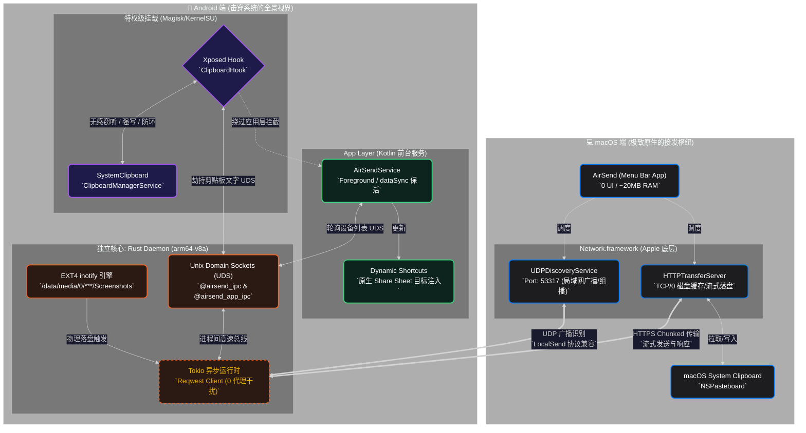

  

<h1 align="center">🚀 AirSend (macOS)</h1>

  
  
  
  
  
  
  

  <a href="README_en.md">English</a> | <b>简体中文</b>

<h2 align="center">📖 你是否也和我一样？</h2>

你深爱着 Mac 丝滑的 UI 和卓越的生产力，但口袋里却揣着一部自由而强大的 Android 手机。

每当你想要把手机里的照片传到电脑，或者想要把手机上的验证码、链接瞬间同步到 Mac 剪贴板时，那道“生态围墙”便横亘在眼前：
*   **AirDrop**？那是 Apple 用户的内部狂欢，Android 只能在墙外张望。
*   **微信/QQ 传输助手**？为了传几个字节，你得忍受流量损耗、隐私扫描和繁琐的登录。
*   **官方 LocalSend**？虽然解决了连通性，但作为跨平台框架（Flutter）的产物，它在 Mac 上显得过于迟钝、臃肿，甚至连窗口圆角都和系统格格不入。

**直到 AirSend 的出现。**

---

<h2 align="center">🔥 AirSend：打破边界，回归本能</h2>

`AirSend` 是一款跨越生态鸿沟的“系统级增强”。我们坚信：**伟大的工具不应该抢夺用户的注意力。**

### 1. 零 UI 设计：它甚至没有一个多余的窗口
AirSend 彻底摒弃了繁琐的主界面。它的全部生命力都凝结在 macOS 菜单栏的一个小巧图标中。
没有复杂的菜单嵌套，没有沉重的面板。它像空气（Air）一样轻盈：
*   **拖拽即发**：直接扔给菜单栏图标，握手自动完成。
*   **静默守候**：只有在传输那一瞬间，它才会优雅地弹出微动画。

### 2. 剪贴板云同步：让 Android 具备“通用剪贴板”
这是 AirSend 的隐形必杀技。基于 LocalSend 协议的深度定制，它能实现**跨平台的剪贴板自动同步**。
当你手机复制了一段文字，Mac 剪贴板已瞬间更新。无需任何操作，两端就像共用了一个大脑。

---

<h2 align="center">💎 为什么选择 AirSend 而不是官方客户端？</h2>

我们在每一个像素 and 每一行代码上都进行了针对 macOS 的“重度”优化。我们没有选择“一套代码跑全平台”的偷懒做法，而是在两端都进行了最硬核的**系统级原生重构**。

---

<h2 align="center">🕸️ 脉络解析 (Architecture Overview)</h2>

为了让极客玩家清晰地了解各端分工，我们绘制了一份极其精密的双端协作网络脑图。在这里，你将看到 Kotlin、Rust 守护进程、Xposed 钩子以及 Swift 底层网络是如何如同精密齿轮般交织互补的。

💡 开发人员手记：如何看懂这张图？ (点击展开)

 

*   **双端通信中枢**：两端设备始终通过中间的黄色虚线（完全实现了 LocalSend 协议标准）完成跨越路由器的握手和通讯，使得互换数据变得无缝。
*   **Android 三核协作防阻塞**：在安卓底座上，最外层 `App Layer` 吸取 `ShortcutManager` 控制着快捷系统级分享面子；居中层级为 `Xposed` 实现了系统级剪贴板侦听并与守护进程通讯；最深层次的 `Rust Daemon` 完全不跑在 JVM 而跑在本机层面直接操作 UDS 套接字、inotify 以及多路复用的 `Tokio` HTTP并发请求。这真正让系统无任何感知地完成同步动作而不会消耗前台丝毫能量。
*   **iOS 设备的先天不足**：Apple 严格控制 App 后台寿命机制，所以类似 `ClipboardHook` 或者 `Daemon inotify` 等极客手段很难施加于 iOS 端，这也是为什么此工具诞生初衷就是用来将 “封闭但不拘小节大度地处理传输包的 Mac 系统接发枢纽” 完美嫁接给 “极具黑客探索权限且开放自由底座的安卓原生引擎”。

---

<h3 align="center">🍎 核心篇章 1：macOS 端的原生进化 (Native Evolution)</h3>

在 Mac 上，我们追求的是**隐形与极致效能**。伟大的工具不应该抢夺用户的注意力。

*   **零 UI 设计**：彻底摒弃繁琐的 Flutter 主界面，全部生命力凝结在菜单栏图标中。**0 交互路径，拖拽即发**。
*   **性能怪兽**：基于 Apple 原生 `Network.framework` 重写底层。优化了碎片文件的并发 Socket 调度，并在 GB 级大文件传输时实现磁盘 0 缓存。
*   **资源极简**：内存占用从官方版的 ~300MB 骤降至 **~20MB**（15倍效率提升），微秒级即时启动。
*   **100% 原生体验**：毛玻璃材质、物理回弹动画，彻底告别跨平台组件的僵硬手感。
*   **智能归档**：后台自动为你分类入库来自手机的图片、文档和附件。

---

<h3 align="center">🤖 核心篇章 2：Android 端的神之特权 (God-Mode)</h3>

为了实现完美的“即刻同步”，普通的应用层权限远远不够。我们在 Android 端向下刺穿了系统封锁，为极客玩家打造了专属的底层挂载模块：

*   **Rust 守护进程 (Daemon) & Magisk 模块保驾**
    *   **痛点**：传统的由 JVM 托管的 Android 后台经常被杀，且轮询监听极耗电。
    *   **突破**：我们将核心逻辑用 Rust 交叉编译为 `arm64-v8a` 本机二进制文件，并包装为 **Magisk/KernelSU 模块**。它利用 Linux 内核级 `notify` (EXT4 物理文件系统监听) 实时感知变化。脱离 App 生命周期，实现常驻不死与极其克制的功耗。
*   **Xposed 剪贴板注入 (LSPosed)**
    *   **痛点**：Android 10 以后封杀了后台读取剪贴板的权限。
    *   **突破**：通过 LSPosed 模块，我们直接 Hook 了系统的 `ClipboardManagerService`。无需任何弹窗确认，实现了**双向、秒级**的剪贴板隐形同步，并从底层实现了智能防死循环 (Loop Prevention) 机制。
*   **原生 Share Sheet (Direct Share) 融合**
    *   去掉了官方 App 繁琐的“打开面板->选设备”流程。你的 Mac 如今会直接以原生分享目标的形式，优雅地嵌入到 Android 系统的分享菜单中。

---

---

<h2 align="center">⚙️ 快速上手 (Deployment Guide)</h2>

**协议基础：** 完全兼容 LocalSend 协议，支持与任何官方客户端互通互联。

### 🍎 Step 1: 部署 Mac 接收端
1. 从 [GitHub Releases](https://github.com/Avi7ii/AirSend/releases/latest) 获取最新的 `AirSend.app`。
2. 拖入 `Applications` 文件夹，开启“开机自启”。

### 🤖 Step 2: 部署 Android 发送端 (双击模式)
*   **🟢 基础模式 (普通用户)**：直接在手机侧下载 [官方 LocalSend 客户端](https://github.com/localsend/localsend/releases) 即可获得基础的高速文件互传能力。
*   **🔴 满血极客模式 (需 Root + LSPosed)**：
    1. 安装 **AirSend 定制版 Android App**。
    2. 在 **Magisk/KernelSU** 中刷入 App 内附带的 `airsend_daemon` 模块（激活高性能内核监听及保活）。
    3. 在 **LSPosed** 中激活 **AirSend 专属模块**（接管系统剪贴板服务）。
    4. **从此，两端设备如同共用一个大脑，无论是复制图文还是跨端发文件，瞬间无感抵达。**

---

<h2 align="center">🤝 贡献与反馈</h2>

如果您也觉得 Android 和 Mac 应该是天生一对，或者讨厌臃肿的工具，请点亮一个 🌟。

---

  <b>AirSend</b> - <i>Simple is the new smart. AirDrop, but for everyone.</i>

