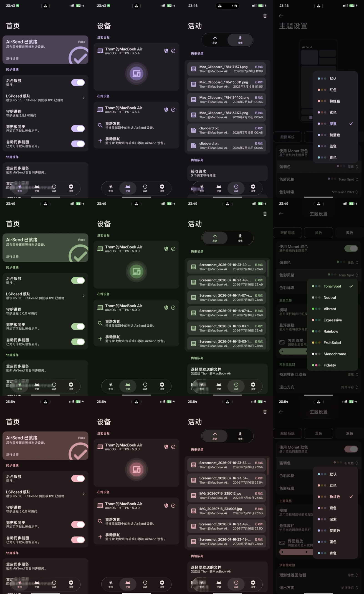
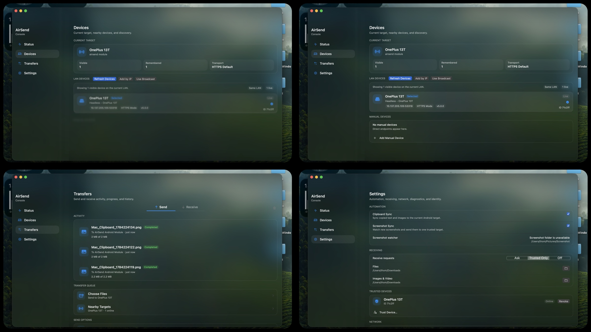
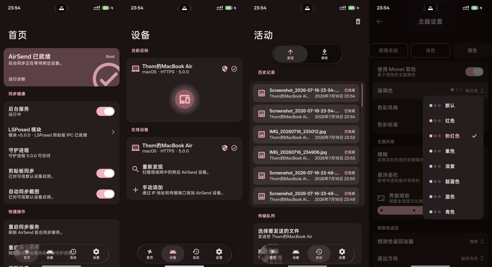
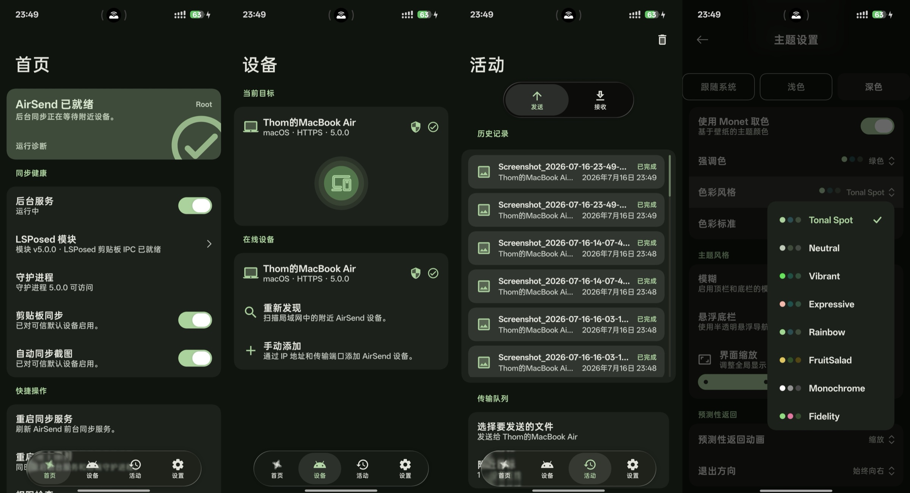
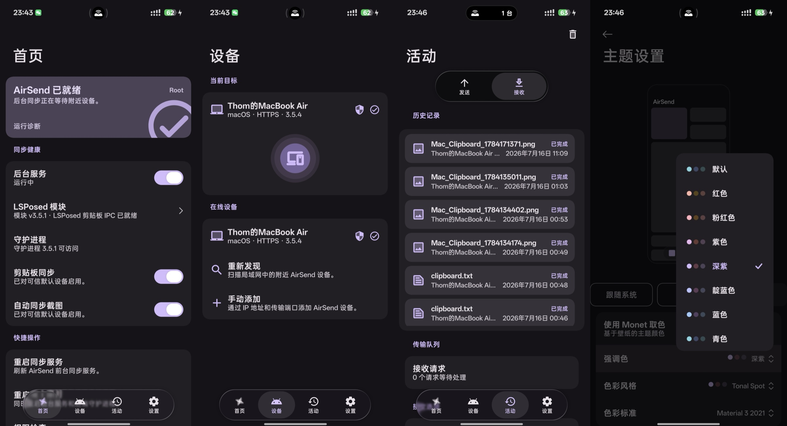
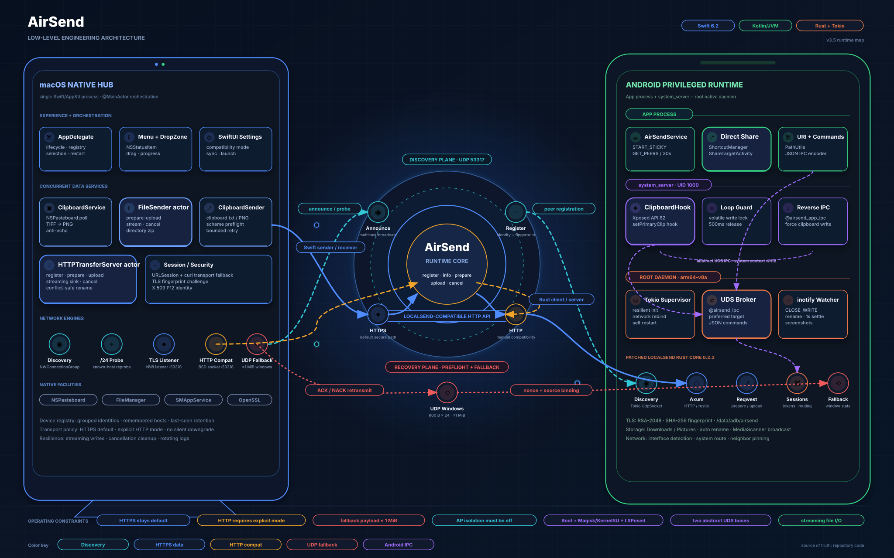
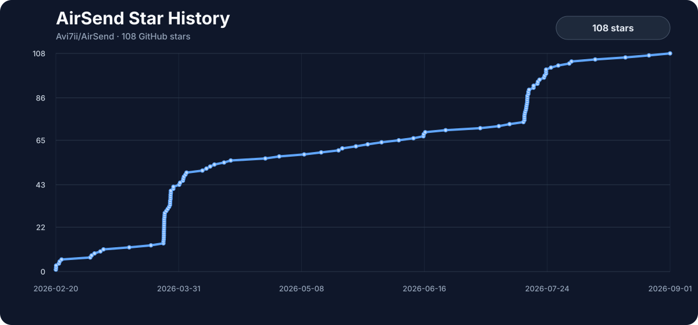

  

<h1 align="center">🚀 AirSend </h1>

  
  
  
  
  
  
  
  
  
  

  <a href="README_en.md">English</a> | <b>简体中文</b>

<h2 align="center">🤔 这是什么？</h2>

AirSend 是一套专为 **Mac + Android** 用户设计的跨平台互联工具，核心目标是：**让文件传输和剪贴板同步像 AirDrop 一样顺手，而不需要两台 Apple 设备。**

它由两部分组成：
- **macOS 端**：一个用 Swift 原生开发的菜单栏应用，内存占用约 20MB，没有主窗口，拖拽即发
- **Android 端**：按需选择——可以直接用官方 LocalSend，也可以安装 AirSend 定制 App 获得系统级深度集成

> **网络要求**：两台设备需在同一 Wi-Fi 局域网下，路由器未开启 AP 隔离。默认仍优先使用 HTTPS；如果你所在的是“能发现但几乎传不动”的校园网/宿舍网，请看下文的 `HTTP 兼容模式`。

---

<h2 align="center"> ⚖️ 和同类软件的区别 </h2>

| 对比项           | 官方 LocalSend       | KDE Connect              | 官方 AirDrop            | AirSend                          |
| ---------------- | -------------------- | ------------------------ | ----------------------- | -------------------------------- |
| macOS 界面       | ✅ Flutter 跨平台主窗口 | ✅ 菜单栏 / 配对管理工具 | ✅ 系统原生分享入口     | ✅ 纯 Swift 原生菜单栏，无主窗口 |
| 内存占用         | ~300MB               | 中等，常驻后台组件       | ✅ 系统内建能力，无独立主窗 | ✅ **~20MB**                     |
| 剪贴板同步       | ❌                    | ✅ 手动 / 插件式同步      | ✅ Apple 设备间通用剪贴板 | ✅ 双向自动（Android ↔ Mac）      |
| 截图自动推送     | ❌                    | ❌                        | ❌                       | ✅ 截图秒到 Mac 下载目录          |
| 图片剪贴板同步   | ❌                    | ❌                        | ✅ Apple 生态内通用剪贴板 | ✅ Mac 复制图片自动发到 Android   |
| Android 后台保活 | 依赖系统进程管理     | 依赖 Android 后台策略    | ❌ 不支持 Android        | Rust 守护进程，脱离 App 生命周期 |
| 系统级剪贴板访问 | ❌                    | ❌                        | ❌ 不支持 Android        | ✅（需 Root + LSPosed）           |
| 复杂拖拽体验     | ❌                    | ❌                        | ❌                       | ✅ 弹窗拖拽发送                    |
| 协议兼容性       | ✅ LocalSend 标准协议 | ✅ 独立协议生态          | ✅ Apple 生态原生能力    | ✅ 完全兼容 LocalSend 协议        |

---

<h2 align="center">✨ 主要功能 </h2>

### 📁 文件传输

将文件拖拽到 macOS 菜单栏图标即可发送。支持两种模式：
- **广播模式**：同时发给局域网内所有在线的 AirSend/LocalSend 设备
- **单播模式**：在菜单中选中特定设备，只发给该设备

接收到的文件直接以流式写入保存到下载目录，文件名冲突时自动重命名（如 `photo (1).jpg`），不占用额外内存缓存。

在家庭路由器、手机热点等正常局域网下，AirSend 默认继续使用 LocalSend 标准 HTTPS 协议，Android 端直接用官方 LocalSend App 即可与 Mac 互传文件，无需额外配置。

但如果你所在的是校园网、宿舍网或其他策略复杂的企业/学校局域网，官方 LocalSend 往往只能停留在“发现得到设备，但实际数据传不动”。这时需要使用 AirSend 的完整模式和下方的 `HTTP 兼容模式`。

### 📋 剪贴板双向同步

**Android → Mac**：在手机上复制文字，Mac 剪贴板会在几秒内自动更新，无需打开任何 App，无弹窗提示。需要完整模式（Root + LSPosed）。

**Mac → Android**：在 Mac 上复制内容，Android 剪贴板同步更新，同样无感知。

**防死循环设计**：收到对端内容并写入本地剪贴板时，会设置内部标志位，避免触发新一轮同步。Mac 端接收到的剪贴板临时文件（clipboard.txt）会在读取内容后立即删除，不留磁盘痕迹。

### 📸 截图自动发送（Android → Mac）

Android 截图后，不需要打开任何 App、不需要手动分享，截图文件会直接出现在 Mac 的下载目录里。

实现方式：Rust 守护进程通过 Linux `inotify` 持续监听截图目录，检测到新文件写入完成后延迟 1 秒（等待 EXT4 完成写盘），然后直接通过默认 HTTPS 或兼容模式下的 HTTP 链路推送至 Mac。兼容 AOSP 原生截图路径及 MIUI、HyperOS、ColorOS 等常见定制 ROM 的路径。

### 🖼️ 图片剪贴板同步（Mac → Android）

Mac 端复制截图或图片时，会优先检测剪贴板中是否存在 TIFF 格式图片数据，转换为 PNG 后通过默认 HTTPS 或兼容模式下的 HTTP 链路发送到 Android。

### 📱 系统分享菜单集成（Direct Share）

在 Android 上分享文件时，Mac 设备会直接出现在系统的直接分享目标列表里，类似"发送给联系人"的效果。无需打开 AirSend App，选中即发。

### 🌐 校园网 / 复杂局域网兼容

AirSend 3.0.0 新增了一个**默认关闭、需手动开启**的 `HTTP 兼容模式`，专门给“设备在线、发现正常、但 HTTPS 数据面反复超时”的校园网环境准备。

- 默认仍是 **HTTPS 安全模式**，不会影响正常家庭网络或与官方 LocalSend 的标准协议互通
- 当校园网里 **能发现但发不出去** 时，可在 macOS 菜单栏 `Advanced -> Compatibility Mode (HTTP)` 手动打开兼容模式
- 打开后，Mac 端会启用 plain HTTP 接收链路；发送端会在真正发文件/文字前做一次数据面预检，尽量选择当前校网里真正可通的传输路径
- 如果校园网把 UDP multicast 压掉，AirSend 会在大网段里按 `/24` 切片扩散探测，并额外记住最近可达的设备 IP，后续通过轻量级回找探测让设备列表更快恢复、更不容易消失
- 也就是说，AirSend 解决的不只是“能发现但传不动”，也包括“切到校园网后菜单里经常看不到手机”这一类设备列表稳定性问题
- 这条兼容路径是 AirSend 针对复杂局域网额外做的能力，**官方 LocalSend 当前做不到**
- 建议只在校园网/宿舍网这类异常环境下开启；家庭路由器和热点仍推荐保持默认 HTTPS
- 兼容链路本身也做了边界收口：默认不静默降级、增加取消和超时回收、限制 fallback 仅处理小 payload，并通过来源绑定与 session nonce 降低串包风险

---

<h2 align="center"> 📋 系统要求 </h2>

| 平台                    | 要求                                                |
| ----------------------- | --------------------------------------------------- |
| macOS                   | macOS 15 Sequoia 及以上                             |
| Android（基础文件传输） | Android 8.0+，安装官方 LocalSend 即可               |
| Android（完整功能）     | Root 权限 + Magisk 或 KernelSU + LSPosed            |
| 网络                    | 两端设备处于同一 Wi-Fi 局域网，路由器未开启 AP 隔离 |
| 防火墙                  | 放行 UDP 53317，以及 TCP 53317-53319               |

---

<h2 align="center">✨ AirSend 5.0：跨端重塑</h2>

<b>Android 液态玻璃 × Material 3 · 原生 macOS 玻璃控制台</b>

  

Android 控制台：状态、设备、传输活动与可深度定制的 Material 主题

  

macOS 原生玻璃控制台：设备、传输、自动化与完整运行设置

<h3 align="center">🎨 一套界面，多种气质</h3>

Material 3、Monet 动态取色与半透明悬浮组件共同组成 AirSend 的 Android 视觉系统。

  

  

  

---

<h2 align="center">🕸️ 架构总览</h2>

下图面向开发者展示 AirSend 的底层工程架构，包括进程边界、技术栈、IPC、LocalSend-compatible API 适配层以及复杂网络恢复路径。

  

---

<h2 align="center">💻 macOS 端说明 </h2>

### 📌 运行方式

AirSend 完全运行在菜单栏，没有 Dock 图标，没有主窗口。启动后默认开机自启（通过 `SMAppService` 实现，macOS 15+）。

### 🔄 自动更新

Mac 端使用 Sparkle 自动检查并下载新版本。更新下载完成后，菜单栏里会出现 **Update ready, restart now?** 提示；点击提示或底部更新卡片即可重启并安装，无需再手动从 GitHub 下载替换。

### 📂 拖拽发送文件

将文件拖向菜单栏图标时，一个半透明的 DropZone 浮窗会自动出现。松手后立即发起 LocalSend 握手，传输进度显示在浮窗内。如果 8 秒内对方无响应，浮窗自动最小化到菜单栏（菜单栏图标出现白色小圆点），传输在后台继续进行。

**发送目标**：默认广播给局域网内所有设备；在菜单中选中特定设备后，只会发给该设备（单播）。历史连接过的设备会被记住，即使当时不在线也会保留在列表中。

**文件接收**：收到来自 Android 的文件后，Mac 端**自动接受，无需确认弹窗**，直接以流式写入保存到下载目录。

### 📋 剪贴板监听

Mac 端每 3 秒（合并唤醒容差 1.5 秒）轮询一次 `NSPasteboard.general.changeCount`：

- 检测到**图片**（TIFF）→ 转换为 PNG → 通过 `ClipboardSender` 发送到 Android
- 检测到**纯文字** → 包装成 `clipboard.txt` → 通过 `ClipboardSender` 发送到 Android

收到 Android 发来的 `clipboard.txt` 后，内容写入 `NSPasteboard`，临时文件立即删除（不在下载目录留档）。为防止写入操作本身触发新一轮同步，写入时同步更新 `lastChangeCount`。

---

<h2 align="center"> 🤖 Android 端说明 </h2>

Android 端分两种模式：

### 🟢 基础模式（不需要 Root）

安装官方 [LocalSend](https://github.com/localsend/localsend/releases) 即可与 Mac 互传文件，兼容性最好。

如果你所在的是普通家庭 Wi-Fi 或热点，这也是最推荐的入门方式。  
如果你所在的是**能发现设备、但文件几乎传不动**的校园网/宿舍网，仅靠官方 LocalSend 往往不够，这时需要使用 AirSend 完整模式和 HTTP 兼容能力。

**不包含的功能**：剪贴板自动同步、截图自动推送、Direct Share 快捷方式。

### 🔴 完整模式（需要 Root + Magisk/KernelSU + LSPosed）

安装 AirSend 定制 App 后包含三个组件：

### ① Kotlin 前台服务（AirSendService）

开机自动启动（`BootReceiver`），以 `dataSync` 类型的前台服务持续运行（兼容 Android 14+），`START_STICKY` 保活。每 30 秒向 Rust 守护进程查询一次在线设备列表，并用查询结果更新系统 Direct Share 快捷方式（仅在设备列表实际变化时才更新，避免无意义的 Binder 调用）。

### ② Rust 守护进程（Magisk/KernelSU 模块）

以 Magisk 模块形式随系统启动，完全独立于 App 生命周期。主要职责：

- 绑定 `@airsend_ipc`（接收 Kotlin 和 Xposed 的命令）和 `@airsend_app_ipc`（向 Xposed 推送 Mac 下发的内容）两条 Unix 域套接字
- 通过 `inotify`（`notify` crate）持续监听 `/data/media/0/Pictures/Screenshots` 和 `/data/media/0/DCIM/Screenshots`，检测到截图写入完成后延迟 1 秒（等待 EXT4 页缓存刷盘），再通过 HTTPS / HTTP 兼容链路推送到 Mac
- 通过 LocalSend 协议栈维护一份在线设备表，响应 Kotlin App 的 `GET_PEERS` 查询
- 启动时强制清除所有代理环境变量（`NO_PROXY=*`），确保局域网请求直连 Mac，不经过 VPN 或代理工具
- 监听网络绑定变化，在热点/校园网切换后主动重绑，减少旧 socket 残留导致的假在线

### ③ LSPosed 模块（Xposed）

在 `system_server` 进程中运行，Hook `ClipboardService$ClipboardImpl.setPrimaryClip`：

- **Android → Mac**：用户复制内容时，拦截并将文字通过 UDS 发送给 Rust 守护进程，再由守护进程发往 Mac
- **Mac → Android**：监听 `@airsend_app_ipc` 套接字，收到来自 Mac 的文字后，通过 `ActivityThread.getSystemContext()` 获取系统上下文，以 UID 1000 身份调用 `ClipboardManagerService.setPrimaryClip()`，绕过 Android 10+ 的后台剪贴板限制
- **防死循环**：写入远端内容时设置 `isWritingFromSync` 标志位，500ms 后释放；写入期间的 Hook 回调会被直接丢弃，不触发新一轮发送

---

<h2 align="center"> 🚀 快速上手 </h2>

### 💻 Step 1：部署 Mac 端

1. 首次安装时，前往 [Releases 页面](https://github.com/Avi7ii/AirSend/releases/latest) 下载最新的 macOS ZIP，将 `AirSend.app` 拖入 `/Applications` 后打开
2. 已安装用户请使用 AirSend 内的 **Check for Updates** 升级；Sparkle 会安全退出旧进程、原子替换 App，并重新启动新版
3. 建议在 **Settings → Startup & Updates** 中保持 **Auto-check for updates** 开启

### 🤖 Step 2：部署 Android 端

**基础模式（推荐无 Root 用户）**

直接安装官方 [LocalSend](https://github.com/localsend/localsend/releases)。Mac 和 Android 在同一 Wi-Fi 下即可互传文件，无需任何额外配置。

如果是在校园网/宿舍网里测试，发现两端**能看到彼此、但一发就卡住**，请不要停留在基础模式，直接使用下方完整模式，并在 Mac 菜单栏里手动打开 `Advanced -> Compatibility Mode (HTTP)`。

**完整模式（Root 用户）**

1. 在 [Releases 页面](https://github.com/Avi7ii/AirSend/releases/latest) 下载最新版Magisk模块
2. 在 **Magisk / KernelSU** 中刷入模块，**重启**
3. 在 **LSPosed** 中启用 AirSend 模块，作用域选择 **Android系统和系统框架**，**重启**

完成后，剪贴板同步、截图自动发送、Direct Share 快捷方式会自动工作，无需额外配置。

---

<h2 align="center">❓ 常见问题 </h2>

**Q：两端互相发现不了？**

确认两台设备在同一 Wi-Fi 下，且路由器没有开启「AP 隔离」或「无线客户端隔离」功能（部分路由器默认开启此选项）。防火墙需放行 UDP 53317，以及 TCP 53317-53319。并尝试在 Mac 菜单中点击 `Rescan and Refresh`。

如果是在校园网、宿舍网这种大网段里，AirSend 会优先尝试已知设备回找，再做 `/24` 扩散探测，所以第一次恢复出来可能仍需要几十秒；一旦重新找到，后续列表保活会明显更快。

---

**Q：校园网里能发现设备，但一发就超时或几乎不可用怎么办？**

先确认热点或家庭 Wi-Fi 下是否正常；如果正常，而校园网里只有发现正常、实际传输持续卡住，那通常不是设备本身坏了，而是校园网数据面策略太激进。

- 家庭网络 / 热点：保持默认 HTTPS 即可
- 校园网 / 宿舍网：使用 AirSend 完整模式，并在 Mac 菜单栏 `Advanced -> Compatibility Mode (HTTP)` 手动开启兼容模式
- 官方 LocalSend：目前**没有** AirSend 这条手动 HTTP 兼容路径

---

**Q：切到校园网后，设备列表里一开始看不到手机，或者出现后又消失怎么办？**

AirSend 3.0.0 现在已经补上两层恢复逻辑：

- 首次恢复：在多播失效的大网段里做 `/24` 扩散探测
- 后续保活：记住上次可达的设备 IP，并做轻量级回找探测

所以这种场景下先等第一次恢复完成，之后通常会稳定很多。如果学校网络明确启用了客户端隔离或彻底禁止终端互访，那就超出了 AirSend 本地兼容策略能解决的范围。

---

**Q：剪贴板同步的延迟是多少？**

Android → Mac 方向：Xposed 拦截到复制事件后立即转发，延迟通常在 0.1 秒以内。

Mac → Android 方向：Mac 端每 3 秒轮询一次剪贴板，普遍延迟在 2 秒以内。

---

**Q：不 Root 能用剪贴板同步吗？**

不能。Android 10+ 明确限制后台应用读取剪贴板，只有在 `system_server` 进程中以 UID 1000 权限运行的 Xposed 模块才能绕过这一限制。

---

**Q：收到的文件保存在哪里？**

Mac 端保存在 `~/Downloads`（下载文件夹），文件名冲突时自动在文件名末尾加序号（如 `image (1).png`）。

Android 端照片保存在 `~/Pictures/AirSend`，其他文件保存在 `~/Downloads/AirSend`

---

**Q：截图自动发送需要打开 App 吗？**

不需要。Rust 守护进程作为 Magisk 模块在系统层面独立运行，截图监听和发送均在守护进程内完成，和 AirSend App 是否在前台无关。

---

**Q：发送大文件时 Mac 会卡顿吗？**

不会。`HTTPTransferServer` 采用流式写入（streaming I/O），接收到的数据块直接写盘，不在内存中累积缓冲，因此大文件传输对系统内存几乎没有额外压力。

---

<h2 align="center">📈 Star History</h2>

  

---

<h2 align="center">🤝 贡献与反馈 </h2>

欢迎提交 Issue 反馈问题，或通过 PR 贡献代码。如果这个工具对你有帮助，点一个 🌟 是对项目最直接的支持。

---

  <b>AirSend</b> - <i>Simple is the new smart. AirDrop, but for everyone.</i>

