  

<h1 align="center">🚀 AirSend </h1>

  
  
  
  
  
  
  
  
  
  

  <b>English</b> | <a href="README.md">简体中文</a>

<h2 align="center">🤔 What is this?</h2>

AirSend is a cross-platform connectivity tool designed for **Mac + Android** users. The core goal is simple: **make file transfers and clipboard sync as effortless as AirDrop — without needing two Apple devices.**

It consists of two parts:
- **macOS side**: A natively-built Swift menu bar app, ~20MB RAM, no main window, drag-and-drop to send
- **Android side**: Choose as needed — use the official LocalSend directly, or install the AirSend custom app for system-level deep integration

> **Network requirement**: Both devices must be on the same Wi-Fi LAN, with AP isolation disabled on the router.

---

## ⚖️ How it compares to official LocalSend

| Feature                | Official LocalSend                   | AirSend                                         |
| ---------------------- | ------------------------------------ | ----------------------------------------------- |
| macOS UI               | Flutter cross-platform main window   | Pure Swift native menu bar, no main window      |
| RAM Usage              | ~300MB                               | **~20MB**                                       |
| Clipboard Sync         | ❌                                    | ✅ Two-way automatic (Android ↔ Mac)             |
| Screenshot Auto-Push   | ❌                                    | ✅ Screenshots appear in Mac Downloads instantly |
| Image Clipboard Sync   | ❌                                    | ✅ Copied images on Mac auto-send to Android     |
| Android Background     | Depends on system process management | Rust daemon, independent of App lifecycle       |
| System-Level Clipboard | ❌                                    | ✅ (Requires Root + LSPosed)                     |
| Protocol Compatibility | ✅ LocalSend standard                 | ✅ Fully compatible with LocalSend               |

---

## ✨ Features

### 📁 File Transfer

Drag files onto the macOS menu bar icon to send. Two modes supported:
- **Broadcast mode**: Send to all online AirSend/LocalSend devices on the LAN simultaneously
- **Unicast mode**: Select a specific device in the menu to send only to that device

Received files are saved to the Downloads folder via streaming I/O, auto-renamed on conflict (e.g. `photo (1).jpg`), with no extra memory buffer.

Since AirSend is fully compatible with the LocalSend protocol, Android users can use the official LocalSend app to transfer files with Mac — no extra configuration needed.

### 📋 Two-Way Clipboard Sync

**Android → Mac**: Copy text on your phone, and the Mac clipboard updates automatically within seconds — no app needed, no popups. Requires full mode (Root + LSPosed).

**Mac → Android**: Copy anything on Mac, and the Android clipboard syncs automatically. Equally seamless and silent.

**Anti-loop design**: When synced content is written to the local clipboard, an internal flag is set to prevent triggering another sync cycle. Clipboard temp files (`clipboard.txt`) received from Android are read and immediately deleted — no trace left on disk.

### 📸 Screenshot Auto-Send (Android → Mac)

Take a screenshot on Android and it appears directly in your Mac's Downloads folder — without opening any app or manually sharing.

How it works: The Rust daemon uses Linux `inotify` to continuously monitor screenshot directories. On detecting a new file write, it waits 1 second (for EXT4 page cache flush), then pushes it to Mac via HTTPS. Compatible with AOSP native paths and custom ROM paths (MIUI, HyperOS, ColorOS, etc.).

### 🖼️ Image Clipboard Sync (Mac → Android)

When you copy a screenshot or image on Mac, `ClipboardService` checks first for TIFF image data in the clipboard, converts it to PNG, and sends it to Android via HTTPS.

### 📱 Direct Share Integration

When sharing files on Android, your Mac appears directly in the system's Direct Share target list — like sending to a contact. No need to open AirSend, just tap and send.

---

## 📋 Requirements

| Platform                      | Requirement                                               |
| ----------------------------- | --------------------------------------------------------- |
| macOS                         | macOS 13 Ventura or later                                 |
| Android (basic file transfer) | Android 8.0+, install official LocalSend                  |
| Android (full features)       | Root + Magisk or KernelSU + LSPosed                       |
| Network                       | Both devices on the same Wi-Fi LAN, AP isolation disabled |
| Firewall                      | Allow UDP 53317 and TCP 53317                             |

---

<h2 align="center">🕸️ Architecture Overview</h2>

The diagram below shows the role of each module on the macOS and Android sides, along with the communication links between them.

```mermaid
%%{init: {'theme': 'dark', 'themeVariables': {'background': 'transparent', 'clusterBkg': '#0d0d0d55', 'edgeLabelBackground': '#1a1a2e', 'fontSize': '16px'}}}%%
flowchart TB
    classDef mac_node fill:#1d1d1f,stroke:#007aff,stroke-width:2px,color:#fff
    classDef android_node fill:#0d231e,stroke:#3ddc84,stroke-width:2px,color:#fff
    classDef daemon_node fill:#2b1a13,stroke:#f86523,stroke-width:2px,color:#fff
    classDef magic_node fill:#1e1b4b,stroke:#a855f7,stroke-width:2px,color:#fff
    classDef protocol_line color:#eab308,stroke-width:3px,stroke-dasharray: 5 5

    %% ==========================================
    %% Part 1: macOS Side
    %% ==========================================
    subgraph macOS_Side ["💻 macOS Side (Ultimate Native Hub)"]
        direction TB

        subgraph Mac_App ["App Orchestrator - AppDelegate / @MainActor"]
            AppCore["Menu Bar App / Device Registry / Wakelock"]:::mac_node
            DragDetect["Drag Monitor / DropZoneWindow / 1s idle - 0.1s active / 60px boundary fallback"]:::mac_node
            AppCore --- DragDetect
        end

        subgraph Mac_Security ["Security Layer"]
            CertMgr["CertificateManager / Self-Signed X.509 / TLS Fingerprint"]:::mac_node
            UpdateSvc["UpdateService / GitHub API / Auto Update Check"]:::mac_node
        end

        subgraph Mac_Network ["Network.framework - Dual Engine"]
            UDP_Disc["UDPDiscoveryService / Port 53317 / LAN Broadcast / Stop-on-Connect"]:::mac_node
            HTTP_Trans["HTTPTransferServer NWListener Actor / TLS 1.2-1.3 / ALPN http1.1 / Per-Conn Queue"]:::mac_node
            CertMgr -->|"Inject TLS Identity"| HTTP_Trans
        end

        subgraph Mac_Send ["Send Engines"]
            FileSender["FileSender / HTTPS Chunked / Broadcast or Unicast"]:::mac_node
            ClipSender["ClipboardSender / Text as clipboard.txt / Image as PNG"]:::mac_node
        end

        subgraph Mac_Clipboard ["Clipboard Engine"]
            ClipSvc["ClipboardService 3s Poll / TIFF-PNG Priority / changeCount Guard"]:::mac_node
            Mac_Clip["macOS Clipboard / NSPasteboard"]:::mac_node
            ClipSvc <-->|"Read / Write + Anti-Echo"| Mac_Clip
        end

        AppCore -->|"Schedule"| UDP_Disc
        AppCore -->|"Schedule"| HTTP_Trans
        DragDetect -->|"Drop Event"| FileSender
        ClipSvc -->|"Text Change"| ClipSender
        ClipSvc -->|"Image Change"| ClipSender
        HTTP_Trans -->|"Receive Text / Write"| Mac_Clip
        HTTP_Trans -->|"Stream to Disk / Conflict Rename"| AppCore
    end

    %% ==========================================
    %% Part 2: Android Side
    %% ==========================================
    subgraph Android_Side ["🤖 Android Side (Piercing the System)"]
        direction TB

        subgraph App_Layer ["App Layer - Kotlin"]
            BootRcv["BootReceiver / Auto-Start on Boot"]:::android_node
            ForegroundSvc["AirSendService / Foreground / dataSync / START-STICKY"]:::android_node
            ShortcutMgr["ShortcutManager / Dynamic Direct Share Injection"]:::android_node
            ShareTarget["ShareTargetActivity / Silent Ghost Share Entry"]:::android_node
            BootRcv --> ForegroundSvc
            ForegroundSvc --> ShortcutMgr
        end

        subgraph Magisk_Modules ["Xposed Layer - Runs in system-server Process"]
            LSPosedHook{"ClipboardHook / Hook: ClipboardService.ClipboardImpl"}:::magic_node
            AntiLoop["Anti-Loop Lock / isWritingFromSync volatile / 500ms delay"]:::magic_node
            GodMode["God-Mode IPC Server / LocalServerSocket @airsend-app-ipc"]:::magic_node
            SystemClip["SystemClipboard / ClipboardManagerService - UID 1000 bypass"]:::magic_node
            LSPosedHook --> AntiLoop
            AntiLoop <-->|"Spy / Force-Write"| SystemClip
            GodMode -->|"Inject via ActivityThread context"| SystemClip
        end

        subgraph Rust_Daemon ["Rust Daemon - arm64-v8a - Magisk Module"]
            inotify["inotify / notify crate / EXT4 Close-Write and Rename / 1s cache delay"]:::daemon_node
            TokioCore["Tokio Async Runtime / Reqwest Client / NO-PROXY enforcement"]:::daemon_node
            UDSServer["Unix Domain Sockets / @airsend-ipc and @airsend-app-ipc"]:::daemon_node
            inotify -->|"Screenshot Detected"| TokioCore
            UDSServer <-->|"IPC Command Bus"| TokioCore
        end

        BootRcv -.->|"Verify Daemon Alive"| UDSServer
        ForegroundSvc <-->|"GET-PEERS / 30s poll"| UDSServer
        LSPosedHook -->|"SEND-TEXT via @airsend-ipc"| UDSServer
        UDSServer -->|"push-text-to-app via @airsend-app-ipc"| GodMode
    end

    %% ==========================================
    %% Part 3: LAN Cross-Border Flows
    %% ==========================================
    UDP_Disc <===>|"UDP Broadcast - LocalSend Compatible Peer Discovery"| TokioCore:::protocol_line
    TokioCore ==>|"HTTPS - Screenshot Auto-Send - inotify triggered"| HTTP_Trans:::protocol_line
    ClipSender ==>|"HTTPS - clipboard.txt - Read and Burn on arrival"| TokioCore:::protocol_line
    TokioCore ==>|"HTTPS - Android Clipboard to Mac NSPasteboard"| HTTP_Trans:::protocol_line
    FileSender <==>|"HTTPS Chunked - Drag-and-Drop File Transfer"| TokioCore:::protocol_line

```

📖 How to read this diagram (click to expand)

 

- **Yellow links**: LocalSend HTTPS transport channel — all data between Mac and Android crosses the router here
- **Blue area (macOS)**: Pure Swift, `Network.framework` NWListener, TLS 1.2-1.3 encryption, dedicated dispatch queue per connection
- **Green area (Android App)**: Kotlin foreground service, polls daemon every 30s for online devices, updates Direct Share shortcuts
- **Purple area (Xposed)**: Runs in `system_server` process, bypasses Android 10+ background clipboard restrictions via UID 1000, also serves as the Mac→Android direction endpoint of the IPC bus
- **Orange area (Rust Daemon)**: `arm64-v8a` native process, independent of App lifecycle, communicates via two Unix domain sockets (`@airsend_ipc` and `@airsend_app_ipc`)

---

## 💻 macOS Side

### 📌 How It Runs

AirSend lives entirely in the menu bar — no Dock icon, no main window. It launches at login by default via `SMAppService` (macOS 13+).

### 📂 Drag-and-Drop File Transfer

Drag a file toward the menu bar icon and a frosted-glass DropZone panel appears automatically. Release to immediately initiate a LocalSend handshake; transfer progress is shown in the panel. If no response is received within 8 seconds, the panel minimizes to the menu bar (a white dot appears on the icon) and the transfer continues in the background.

- Defaults to **broadcast** (all LAN devices); select a specific device in the menu to switch to **unicast**
- Previously connected devices are remembered and stay in the list even when offline
- Incoming files are **auto-accepted and auto-saved** with no confirmation popup

### 📋 Clipboard Monitoring

Mac polls `NSPasteboard.general.changeCount` every 3 seconds (wake coalescing tolerance: 1.5s):

| Change Type           | Behavior                                                              |
| --------------------- | --------------------------------------------------------------------- |
| Image (TIFF)          | Converts to PNG → sends via `ClipboardSender` to Android              |
| Plain text            | Wraps as `clipboard.txt` → sends via `ClipboardSender`                |
| Incoming Android text | Written to NSPasteboard; temp file deleted immediately, no disk trace |

---

## 🤖 Android Side

Android supports two modes:

### 🟢 Basic Mode (No Root Required)

Install the official [LocalSend](https://github.com/localsend/localsend/releases) to transfer files with Mac — best compatibility.

**Not included**: clipboard auto-sync, screenshot auto-push, Direct Share shortcuts.

### 🔴 Full Mode (Root + Magisk/KernelSU + LSPosed)

Installing the AirSend custom App gives you three components:

---

### ① Kotlin Foreground Service (AirSendService)

Auto-starts via `BootReceiver`, runs as a `dataSync` foreground service (Android 14+ compatible), `START_STICKY` keep-alive. Polls the Rust daemon every 30 seconds for a device list; only updates Direct Share shortcuts when the list actually changes (avoiding pointless Binder calls).

---

### ② Rust Daemon (Magisk/KernelSU Module)

Starts with the system as a Magisk module, fully independent of the App lifecycle:

| Responsibility        | Implementation                                                    |
| --------------------- | ----------------------------------------------------------------- |
| Screenshot monitoring | `inotify` on two screenshot dirs, 1s Page Cache delay before push |
| Device discovery      | LocalSend UDP broadcast, maintains online device table            |
| IPC bus               | Two Unix domain sockets: `@airsend_ipc` / `@airsend_app_ipc`      |
| Proxy bypass          | Forces `NO_PROXY=*` at startup                                    |

Monitored screenshot paths:
- `/data/media/0/Pictures/Screenshots` (AOSP native)
- `/data/media/0/DCIM/Screenshots` (MIUI / HyperOS / ColorOS, etc.)

---

### ③ LSPosed Module (Xposed)

Runs in `system_server`, hooks `ClipboardService$ClipboardImpl.setPrimaryClip`:

| Direction     | Mechanism                                                             |
| ------------- | --------------------------------------------------------------------- |
| Android → Mac | Intercepts copy event → sends via UDS to daemon → HTTPS push to Mac   |
| Mac → Android | Listens on `@airsend_app_ipc`, writes to system clipboard as UID 1000 |
| Anti-loop     | `isWritingFromSync` volatile flag, released after 500ms               |

---

## 🚀 Quick Start

### 💻 Step 1: macOS Setup

1. Download the latest `AirSend.app` from [Releases](https://github.com/Avi7ii/AirSend/releases/latest)
2. Drag it into `/Applications` and launch it
3. Right-click the menu bar icon → **"Launch at Login"** → enable

### 🤖 Step 2: Android Setup

**Basic Mode (recommended for non-root users)**

Install the official [LocalSend](https://github.com/localsend/localsend/releases). Both devices on the same Wi-Fi and you're ready to transfer files.

**Full Mode (root users)**

1. Download the latest Magisk module from [Releases](https://github.com/Avi7ii/AirSend/releases/latest)
2. Flash the module in **Magisk / KernelSU**, then **reboot**
3. Enable the AirSend module in **LSPosed**, scope set to **Android System and System Framework**, then **reboot**

After setup, clipboard sync, screenshot auto-send, and Direct Share shortcuts all work automatically.

---

## ❓ FAQ

**Q: Devices can't find each other?**

Confirm both devices are on the same Wi-Fi and that the router doesn't have "AP Isolation" or "Client Isolation" enabled (some routers enable this by default). Firewall must allow UDP 53317 and TCP 53317. Also try clicking **Refresh and Rescan** in the Mac menu.

---

**Q: What's the clipboard sync latency?**

Android → Mac: Xposed intercepts the copy event immediately, typically under 0.1 seconds.

Mac → Android: Mac polls every 3 seconds, typical latency under 2 seconds.

---

**Q: Can clipboard sync work without Root?**

No. Android 10+ explicitly prohibits background apps from reading the clipboard. Only an Xposed module running in `system_server` with UID 1000 can bypass this restriction.

---

**Q: Where are received files saved?**

- **Mac**: `~/Downloads` — file name conflicts auto-append a sequence number (e.g. `image (1).png`)
- **Android**: Photos → `~/Pictures/AirSend`, other files → `~/Downloads/AirSend`

---

**Q: Does screenshot auto-send require the App to be open?**

No. The Rust daemon runs as a Magisk module at the system level, independently of whether AirSend App is in the foreground.

---

**Q: Will Mac slow down when sending large files?**

No. `HTTPTransferServer` uses streaming I/O — data is written to disk chunk by chunk without accumulating in memory. Large file transfers have virtually no extra memory pressure.

---

## 🤝 Contributing & Feedback

Bug reports and PRs are welcome. If this tool is useful to you, giving it a 🌟 is the most direct way to support the project.

---

  <b>AirSend</b> · <i>Simple is the new smart. AirDrop, but for everyone.</i>

