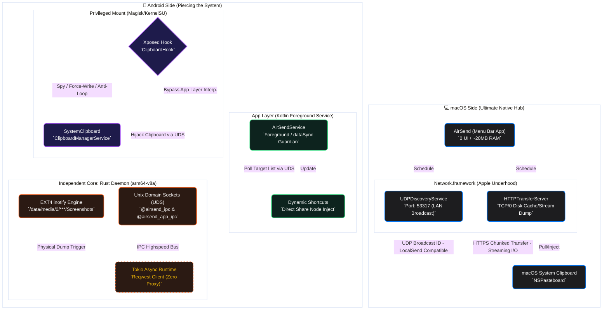

  

<h1 align="center">🚀 AirSend (macOS)</h1>

  
  
  
  
  
  

  <b>English</b> | <a href="README.md">简体中文</a>

<h2 align="center">📖 Do you feel the same way?</h2>

You love the smooth UI and productivity of Mac, but you carry a powerful and free Android phone in your pocket.

Whenever you want to transfer photos or instantly sync verification codes and links to your Mac clipboard, that "ecosystem wall" stands in your way:
*   **AirDrop**? That's an internal party for Apple users; Android can only watch from the outside.
*   **WeChat/QQ File Helper**? For just a few bytes, you have to endure data usage, privacy scans, and tedious logins.
*   **Official LocalSend**? While it solves connectivity, as a cross-platform (Flutter) product, it feels sluggish and bulky on Mac, even the window corners don't match the system.

**Until AirSend.**

---

<h2 align="center">🔥 AirSend: Break Borders, Return to Instinct</h2>

`AirSend` is a "system-level enhancement" that bridges the ecosystem gap. We believe: **Great tools should not fight for the user's attention.**

### 1. Zero UI Design: Not a single extra window
AirSend completely discards tedious main interfaces. All its vitality is condensed into a tiny icon in the macOS menu bar. 
No complex menus, no heavy panels. It's light as air:
*   **Drag & Send**: Just drop files onto the menu bar icon, and the handshake completes automatically.
*   **Silent Watch**: It only pops up an elegant micro-animation at the moment of transfer.

### 2. Clipboard Cloud Sync: Give Android a "Universal Clipboard"
This is AirSend's hidden killer feature. Based on a deep customization of the LocalSend protocol, it achieves **automatic cross-platform clipboard synchronization**.
When you copy text on your phone, the Mac clipboard is instantly updated. No action required; it's like sharing one brain.

---

<h2 align="center">💎 Why choose AirSend over the official client?</h2>

Instead of taking the lazy "write once, run anywhere" approach, we performed hardcore **system-level native rewrites** on both ends.

---

<h2 align="center">🕸️ Architecture Overview</h2>

To give geek users a crystal-clear understanding of how each module performs its duty, we have mapped out an extremely precise dual-device collaboration schematic. Here, you'll see how Kotlin, the Rust Daemon, Xposed hooks, and Swift's core networking interlock like precision gears.

💡 Developer's Note: Reading this graphic (Click to expand)

 

*   **Dual-End Communications**: The macOS endpoint and Android engine always cross the router securely via the yellow dashed path (fully adhering to standard LocalSend protocols) guaranteeing zero friction payload exchanges.
*   **Android Triple-Core Anti-Block Structure**: Deep within its Android roots lies absolute sophistication: at the outer tier `App Layer` commands `ShortcutManager` asserting dominant Direct Share nodes; internally `Xposed Hook` spies over the Systemwide clipboard bus directly translating actions to daemon processes via UDS; and digging down into the soil, our decoupled `Rust Daemon` operates devoid of JVM boundaries relying directly on native sockets, `inotify`, and `Tokio` HTTP requests. This permits "absolute ghost-syncing" preserving phenomenal battery drain performance without user interface clutter whatsoever!

---

<h3 align="center">🍎 Core Chapter 1: The Native Evolution on macOS</h3>

On Mac, we strive for **invisibility and extreme performance**. Great tools shouldn't fight for your attention.

*   **Zero UI Design**: Completely discards the sluggish Flutter main interface. All its vitality is condensed into a tiny menu bar icon. **0 interaction path, drag-and-drop to send.**
*   **Performance Beast**: Rewritten from the ground up using Apple's native `Network.framework`. Optimized concurrent socket scheduling for small files, and achieves zero disk caching during GB-level transfers.
*   **Minimal Footprint**: RAM usage drops from the official ~300MB to merely **~20MB** (a 15x efficiency boost) with microsecond startup speed.
*   **100% Native Feel**: Glassmorphism materials and physics-based animations. Say goodbye to the stiff feel of cross-platform components.
*   **Intelligent Archiving**: Automatically categorizes incoming photos, documents, and archives from your phone in the background.

---

<h3 align="center">🤖 Core Chapter 2: The God-Mode on Android</h3>

To achieve perfect "instant sync", ordinary app-level permissions simply aren't enough. We pierced through the system blockade to build exclusive, low-level modules for Android geeks:

*   **Rust Daemon & Magisk Module Guardian**
    *   **The Pain Point**: Traditional JVM-hosted Android background processes are frequently killed, and file polling drains the battery.
    *   **The Breakthrough**: We cross-compiled the core logic into an `arm64-v8a` native binary using Rust, packaged as a **Magisk/KernelSU module**. It leverages Linux kernel-level `notify` (EXT4 physical file monitoring) to perceive changes in real-time. Freed from the app's lifecycle, it runs persistently with extremely restrained power consumption.
*   **Xposed Clipboard Injection (LSPosed)**
    *   **The Pain Point**: Android 10+ killed the permission to read the clipboard in the background.
    *   **The Breakthrough**: Via the LSPosed module, we directly hooked the system's `ClipboardManagerService`. It achieves **two-way, instant** clipboard sync invisibly without any prompts, featuring a low-level Loop Prevention mechanism.
*   **Native Share Sheet (Direct Share) Integration**
    *   We eliminated the cumbersome "Open App -> Select Device" workflow. Your Mac now elegantly implants itself directly into Android's native Share Sheet as a direct target.

---

---

<h2 align="center">⚙️ Deployment Guide</h2>

**Protocol Foundation:** Fully compatible with the LocalSend protocol, meaning it can interconnect with any official client.

### 🍎 Step 1: Deploy Mac Receiver
1. Get the latest `AirSend.app` from [GitHub Releases](https://github.com/Avi7ii/AirSend/releases/latest).
2. Drag it into the `Applications` folder and enable "Launch at Login".

### 🤖 Step 2: Deploy Android Sender (Dual Mode)
*   **🟢 Basic Mode (For Normal Users)**: Simply download the [official LocalSend client](https://github.com/localsend/localsend/releases) on your phone to get high-speed file transfer capabilities.
*   **🔴 Geek Pro Mode (Requires Root + LSPosed)**:
    1. Install the **AirSend Custom Android App**.
    2. Flash the bundled `airsend_daemon` module via **Magisk/KernelSU** (Activates high-performance kernel monitoring & persistence).
    3. Activate the **AirSend Module** in **LSPosed** (Takes over system clipboard services).
    4. **From now on, the two devices share a single brain. Whether copying text or sending files, it arrives instantly and invisibly.**

---

<h2 align="center">🤝 Contributing & Feedback</h2>

If you also believe Android and Mac are a match made in heaven, or hate bloated tools, please light up a 🌟.

---

  <b>AirSend</b> - <i>Simple is the new smart. AirDrop, but for everyone.</i>

